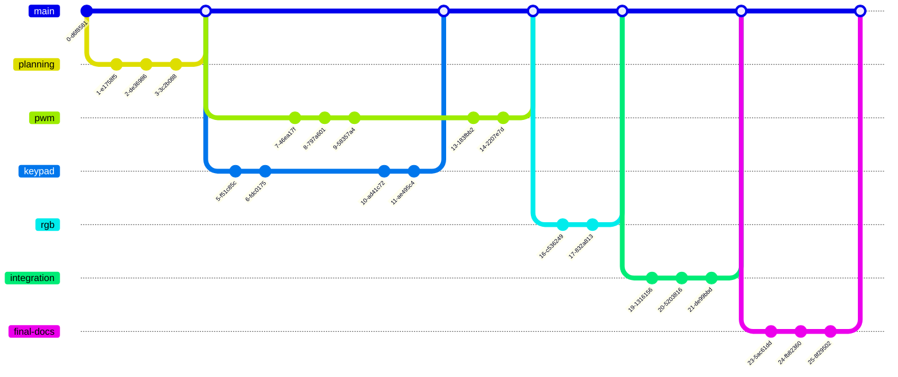

# General Development Process 

- Do your initial planning activities in a `planning` branch.
    - Plan out your software architecture.
    - Complete the workload distribution form.
    - Write pseudocode or create flowcharts for the main components.
    - Create a preliminary circuit diagram.
- Once your initial planning is done, create a pull request for the `planning` branch.
- For each module or feature (e.g., keypad, RGB LED, pwm, LCD, etc.):
    - Create a new branch.
    - Do any initial planning (e.g., pseudocode, flowcharts, diagrams) that wasn't done earlier. Do this and commit this before writing code.
    - Implement and test the module. Use separate test files to test the module (i.e., don't test everything in the main app; using separate test files lets you easily re-run tests to verify nothing broke or the module still works).
    - Create a pull request. The pull request must include evidence of your module working (e.g., screenshots from the AD2 showing that your code works, or some other form of validation).
    - Have your team member(s) perform a code review.
    - Once your team member(s) have approved the pull request, merge it into `main`.


We're following a [feature branch workflow](https://www.atlassian.com/git/tutorials/comparing-workflows/feature-branch-workflow).
The git history will look something like this:



> [!IMPORTANT]
> No development should happen in the `main` branch. Everything should be done in a separate branch and be review/approved by the team via pull requests. When you're working together on integration, this should still be done in a separate branch.

> [!TIP]
> Remember to use `--set-upstream origin <branch-name>` when pushing your new branch for the first time.
> ```
> git push --set-upstream origin <branch-name>
> ```


## Git Resources

Please refer to any of the git resources I've put on Brightspace or linked in the [intro to git presentation](https://msu-eele-465.github.io/intro-to-git/). There are so many git resources, tutorials, and videos out there; I'm sure you'll find something that helps and makes sense for you.
